# SpArX-Visualisation
GUI and Visualisation for SpArX Neural Networks


Local-host:
===========

1.  Clone repo from: [https://github.com/SpArX-Group-10/SpArX-Visualisation](https://github.com/SpArX-Group-10/SpArX-Visualisation)

    ```bash
    git clone https://github.com/SpArX-Group-10/SpArX-Visualisation
    ```

2.  Install requirements:
    
    ```bash
    pip install -r server/requirements.txt
    ```
    
3.  Start the server:
    
    ```bash
    python server/server.py
    ```

4. In a separate terminal, install yarn dependencies and start:
   
   ```bash
   yarn install
   yarn start
   ```
    

GUI: Model setup:
===========

### Upload dataset:

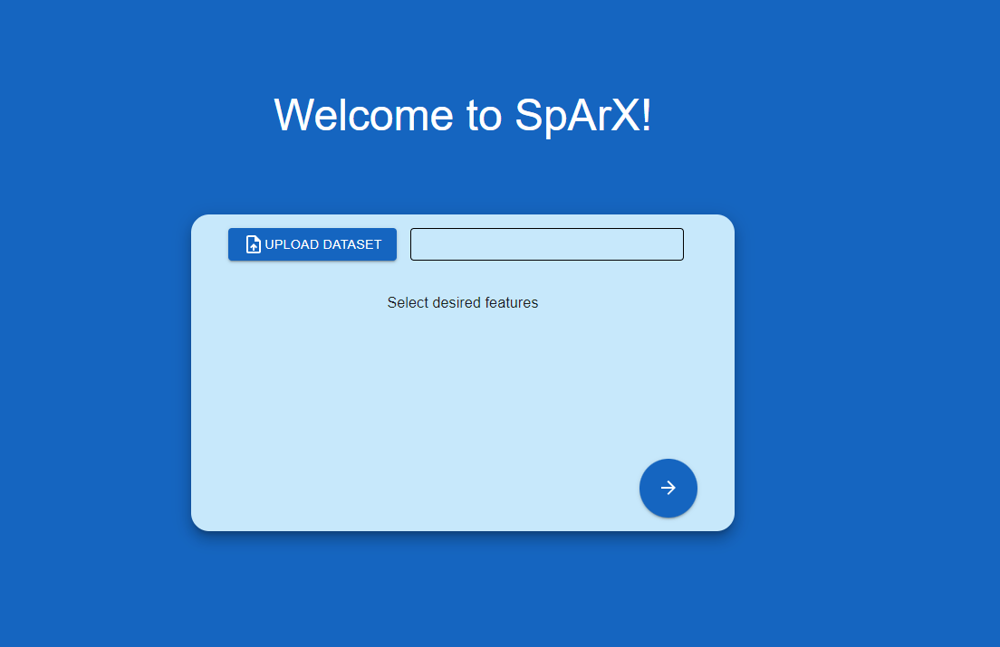
*Upload Dataset*

For example, using the Iris dataset:

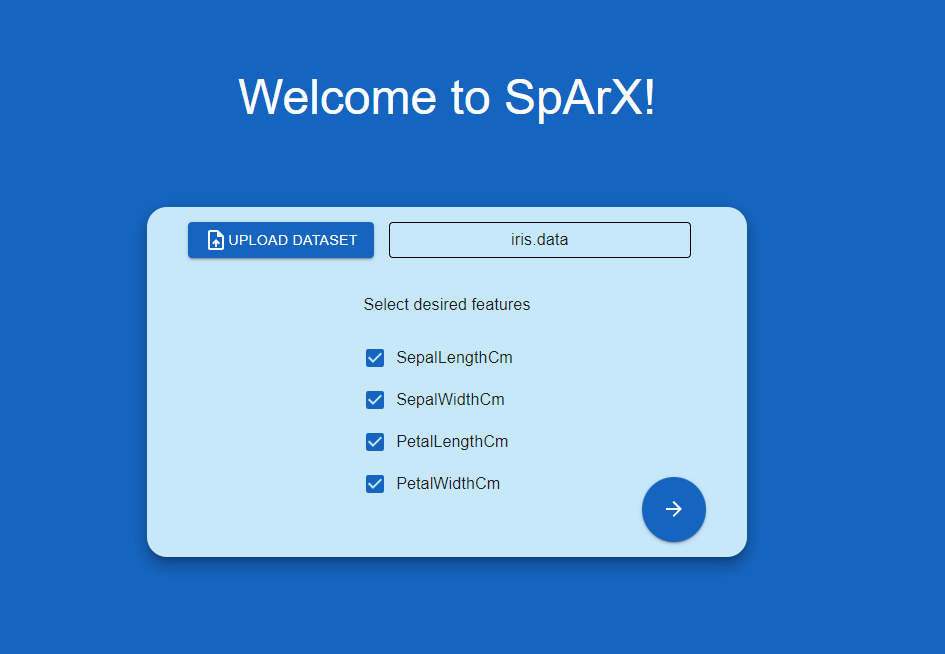
*Uploaded Iris dataset*

Click on the ticks to choose which features of the dataset you would like to include.

### Neural network structure:

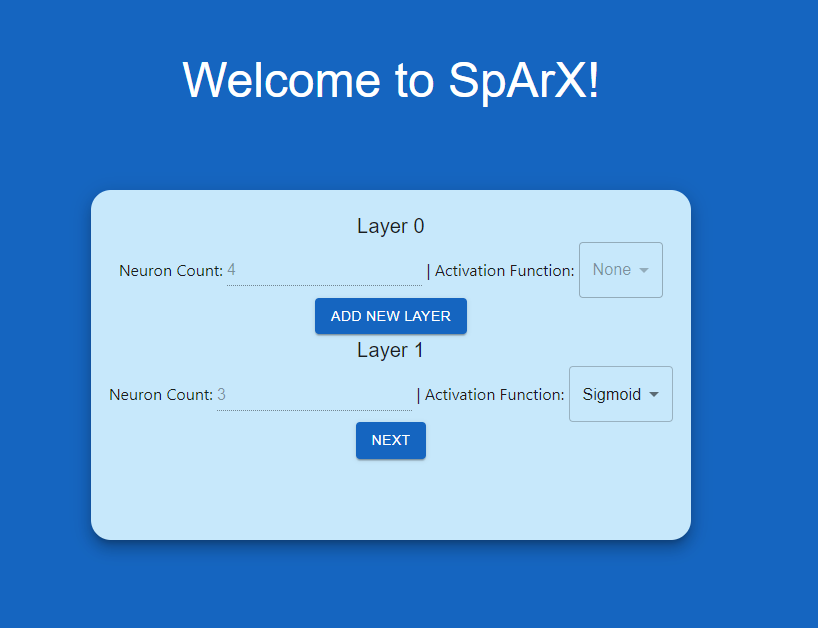
*Neural network structure options*

To add more layers, click on “Add new layer”.

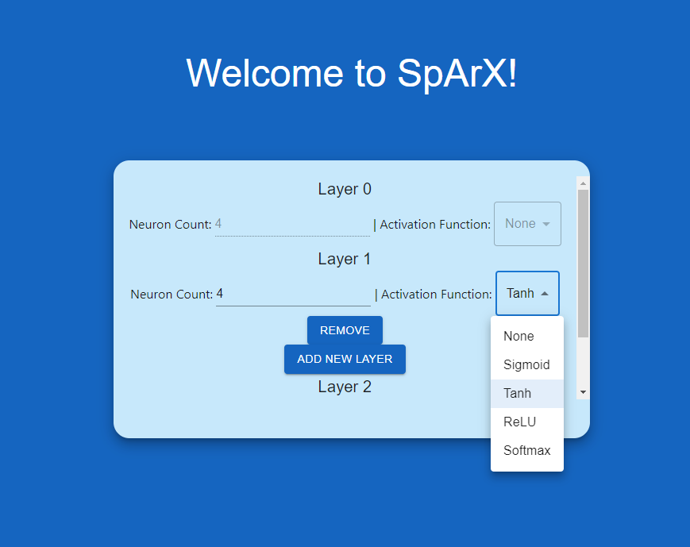
*Neural network activation function options*

You can decide the number of neurons in each layer and select the activation function for each layer.

If you change your mind, you can remove a layer by clicking on “Remove”.

### More hyperparameter options:

Along with choosing the neural network structure, you can decide on other hyperparameters.

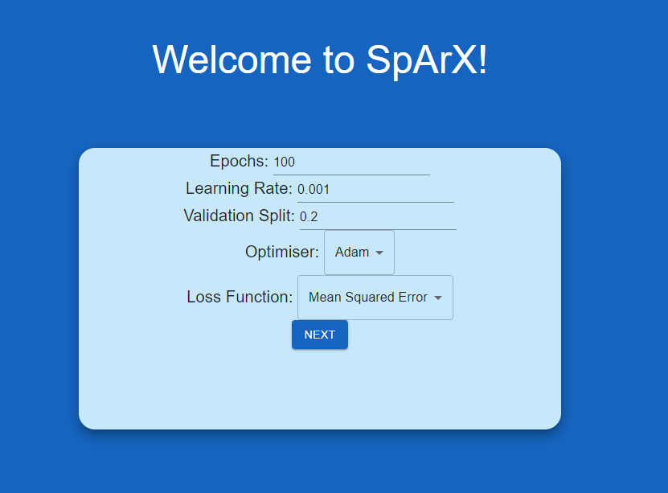
*Hyperparameter options*

Note: The number of epochs must be an integer (it will not let you put a non-integer value)

### Clustering options:
#### Global merging
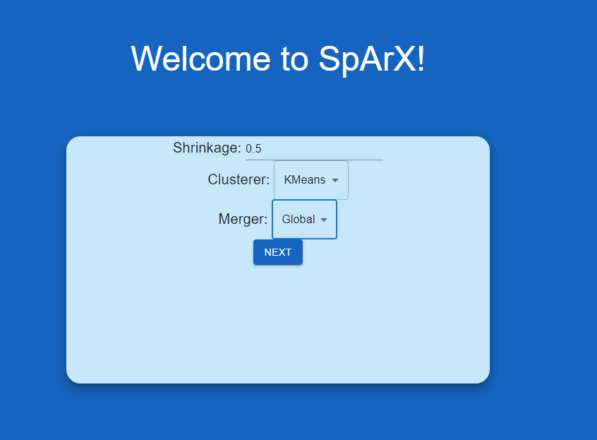
*Global merging*
#### Local merging
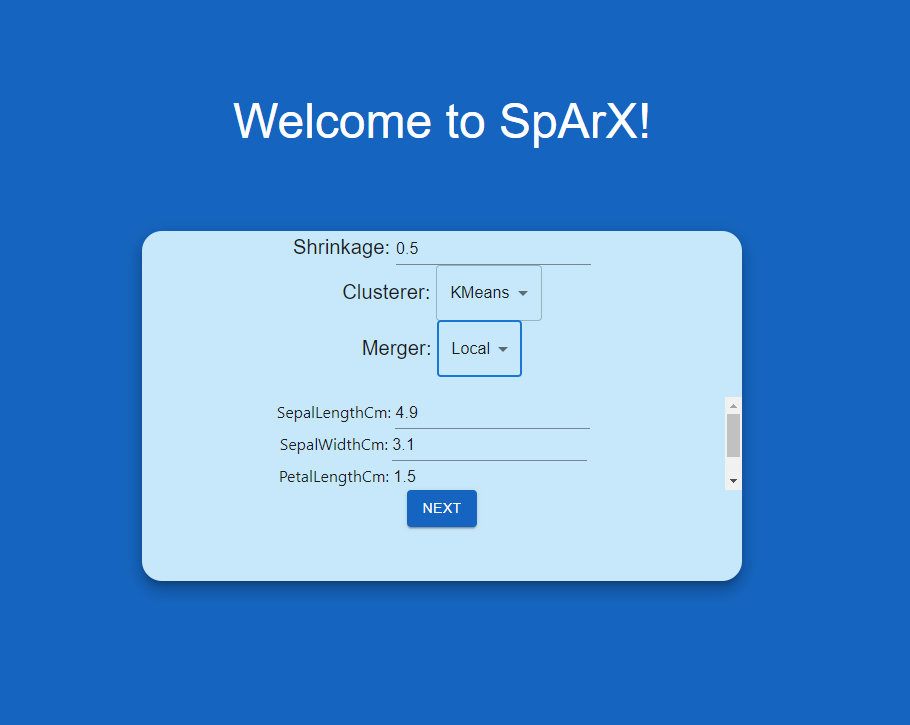
*Local merging*

### Model setup is done!

Depending on the size of your dataset, neural network, number of epochs… etc it might take a long time to get your visualisation.

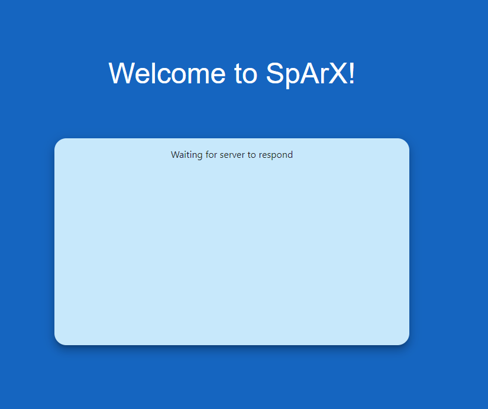
*Model setup waiting for server*

Visualisation:
===========

### Starting off:

You will start off by seeing the output layer.

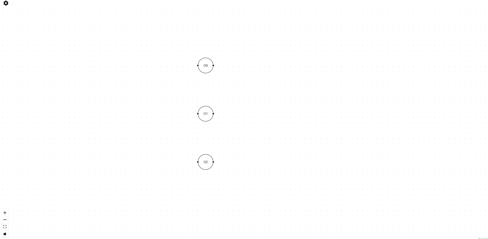
*Output layer*

### To show a previous layer:

Click on one of the output neurons to display the previous layer.

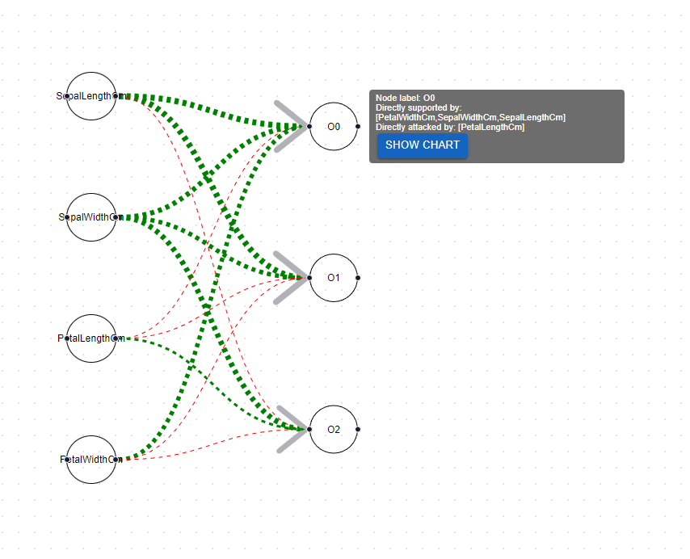
*Click on output neuron*

### Piechart visualisation:

Click on “Show Chart” to see the piechart visualisation.

This shows whether a previous node is a “Supporter” (in green) or an “Attacker” (in red).

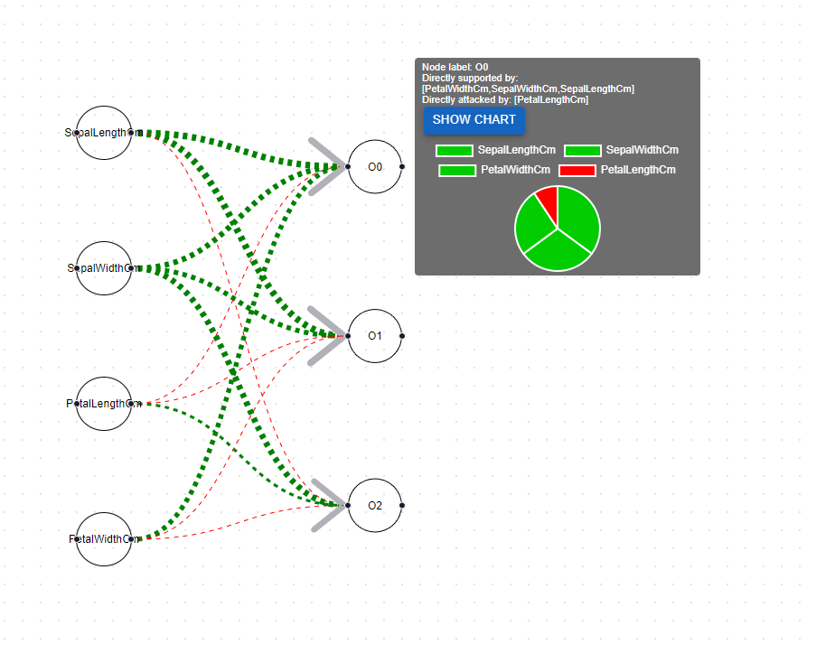
*Show pie chart*

You can hover over the piechart to see which areas represent which attacker/supporter:

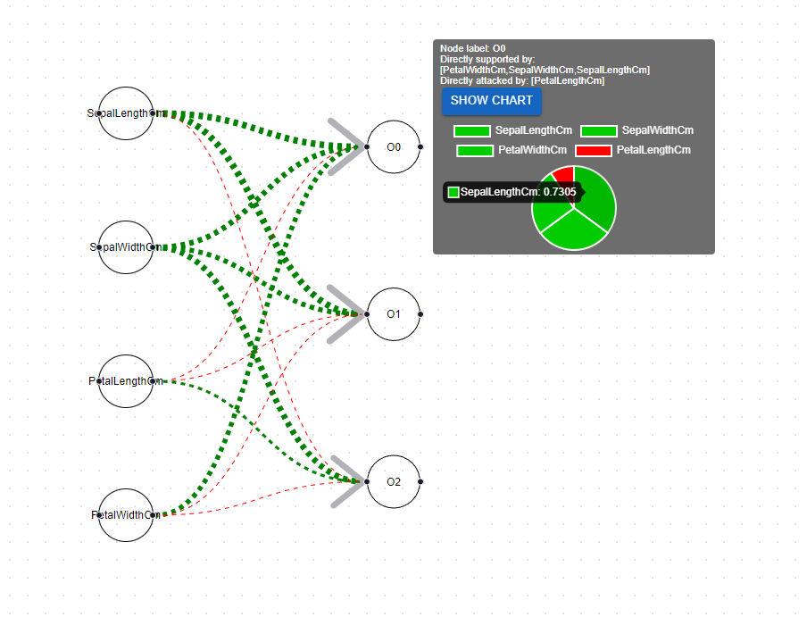
*Show pie chart supporters*

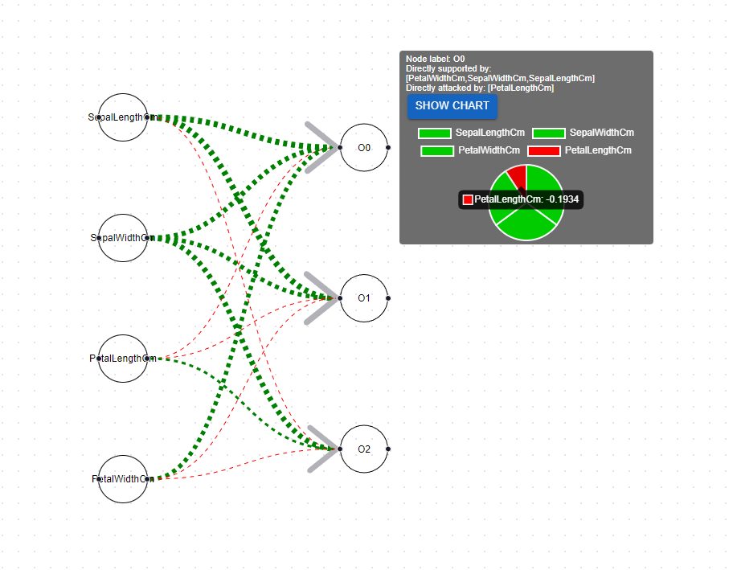
*Show pie chart attackers*

### Visualisation options:

You can customise the number of layers and supporters/attackers to display per click.

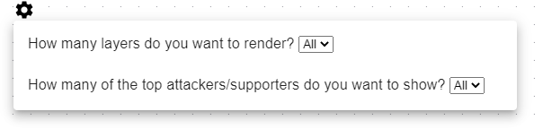
*Visualisation options*

#### Previous layers to render:

You can choose to display from 1 to all previous layers when clicking on a neuron.

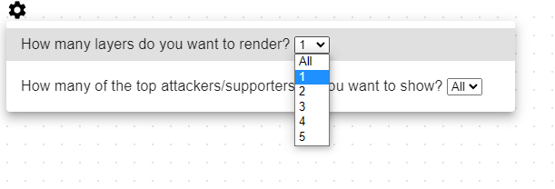
*Render previous layers option*

#### Top attackers and supporters:

You can display from the top 1 to all supporters/attackers per click. How does this work with the multi-layer render option? We only display the top attackers/supporters for all neurons in each newly rendered layer.

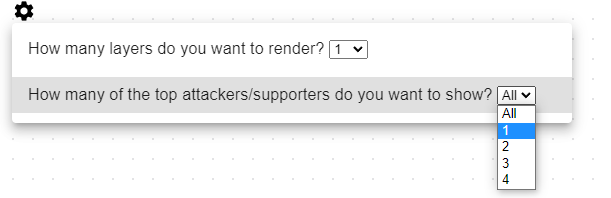
*Top attackers/supporters option*

### Instructions:

For some guidance on how to navigate the visualisation, click on the 'Question Mark' to view some Instructions.

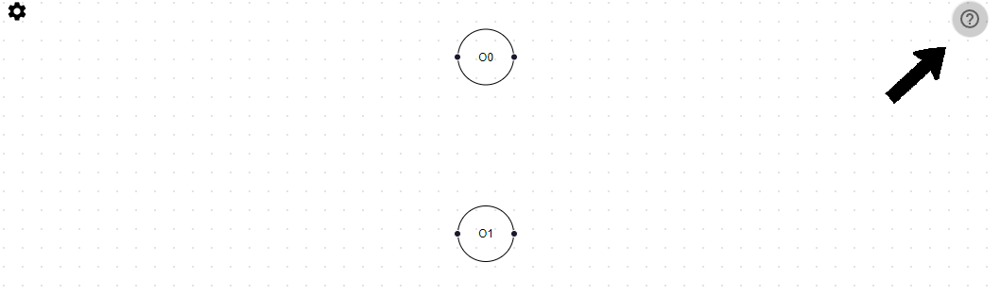
*Instructions icon*

Some helpful instructions on how to navigate the visualisation.
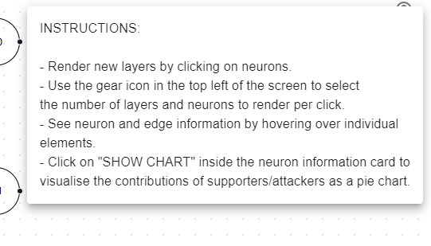
*Instructions*